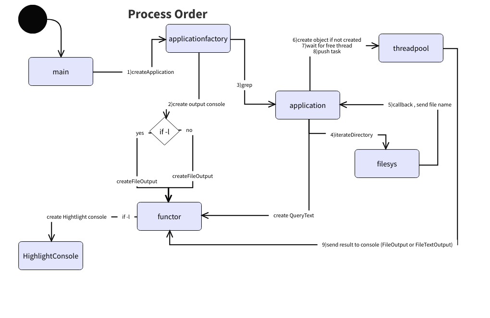

# Application 'grepapp'

## Parameters
```
-d - required parameter to set the directory for the searching
-t - required parameter to set the word(s) to search
-l - not mandatory parameter, alows listing the files where query has been found
-h - not mandatory parameter, shows the parameters in console window.
```
# Configuration
* gcc version 13.2.0
* GNU Make 4.3
* cmake version 3.30.4
* OS: Ubuntu 24.04 LTS

# Design
## Assumption:
The functionality should correspond to the 'grep functionality with the following parameters:
grep -r "[query]" -a --text [-l]  

## Details
### Functional requirements
There are the following functional requirements:
 * The utility outputs results to the console. (RQ1)
 * The utility should work reasonably fast (e.g. utilize all cores during the search). (RQ2)

#### RQ1
The original grep allows to customize the format of the finale output, we consider just two:

* Display file and the text line .
* Display the list of the files where query has been found.

Assumptions:
* if query is not defined - the error 'No text' must be displayed. No processing.
* if directory for the search is not define, the error 'No directory' must be displayed. No processing.

Also, original 'grep' allows to filter the files according to their attributes. Due to the time restriction, the following filter has to be implemented:

symlinks should be excluded from the processing.

#### RQ2
To utilize the CPU Cores it is necessary to have the set of the threads to process the tasks.

### Proposed functionality

* activate the pool of the threads
* the pool size must not exceed the number of the cores
* it is reasonable to have one task to process one file.
* the number of the files may be extremely big (some thousands), It is clear, that speed of the file gathering is faster than file processing. So, is is possible to have the pretty big list of the tasks are waiting for the processing. The way to wait the 'free' thread looks reasonable.
* Processing should be stopped if there are not any tasks in the pipeline.

### Summary
The following solution is proposed to meet the requirements




Component description
* main - main application file
* applicationfactory - implementation of the factory to create the corresponded application(in our case - grep), functions to iterate through the directories and grep function.
* application - implementation of 'grep' function
* filesys - implementation of the recursivelly iteration through the directory.
* functor - implementation of the classes that override operator(), it is necessary to customize the callback functions, filtering.
* threadpool - implementartion of the thread pool to run the restricted number of the threads.
* highlightconsole - implementation of the console output to highlight the found word.

### Details
* ApplicationFactory
Covers the following:
Initiatye the grep application, according to the input parameters:
    *  Analyze the input parameters and inform about the error if parameter data is wrong.
        * if directory is not defined show an error 'No directory"[AF1]
        * if query is not defined, show an error "No text'[AF2]
        * if -l is defined, ionitiate application with the File output, otherwise file + text output.[AF3]
        * show helpe if -h is defined and ignore all the rest options.[AF4] 
        * initiate 'grep' with the filter to ignore the executable files.[AF5]
    File filter (to ignore symlinks)
    * if file is symlink - exclude it from the processing[FF1]

* application (grep in our case)
Covers the following:
    * initiate the recursive iteration through the directory[GP1]
    * run iteration it with the filter.[GP2]
    * get and process the file with to find the query.[GP3]
    * initiate the ThreadPoll[GP4]
    * create the task to push it into thread pull[GP5]
    * push task if ThreadPool has the available thred for it.[GP6]
* filesys
Covers the following:
    * go through all sub-directories and files[RI1]
    * if there is a file, send it to the grep for the futher processing.[RI2]

* functor:
    Find required query in the file
    * get file name and query as input parameter[FQ1]
    * process the file body to find the lines with the query[FQ2]
    * if query is found, send file name and file text-line with query back to the grep[FQ3]
    * List result in format: file name: text line ...[LT1]
    * List result in format: file name ...[LT2]
* ThreadPool to utilize the CPUs
    * initiate the pool of the threads.[TP1]
    * the size of the thread pool sould not be fixed.[TP2]
    * add the task to execute[TP3]
    * it has to be possible to wait if all available threads are busy.[TP4]
* Highlight the found information (additional option)[HT1]

#### Application Factory
Module is implemented in the two files:

* appfactory.cpp
* appfactory.h
 
app_type createApplication(
    int argc,
    char *argv[]
    )
Covers the requirements; AF1, AF2, AF3, AF4, AF5

Description:
The function creates the application according to the input parameters.
To cover RQ1, the console output has the two options:
* list of the files
* list of the files and the lines where query is found.
```
The input parameters of the application:
* -d "[directory path]"
* -t "[text to search]"
* -l - optional, allows to list the files without the text lines.
```

##### Application: grep
application.cpp
application.h

Function: grep
Input parameters:
    * const string & path - path to the directory to search.
    * const string & query - plain text to search
    * filter_func_type filter - filter, that allows to ignore symlinks (in our case)
    * output_find_func_type output - call back, where 'grep' drops the results.

Covers the requirements: GP1, GP2, GP3, GP4, GP5, GP6, FF1

Description:
create the instance of the ThreadPool, set the size of the poll (std::thread::hardware_concurrency() is used to utilize all cores)
The function gets the fila name from the iterateDirectory, create the task, wait the free thread, and push task to pool to run.

##### filesys iterateDirectory
filesys.cpp
filesys.h

Function: iterateDirectory

Input parameters
    * const string &path - path to the directory to search.
    * filter_func_type filter - filter, that allows to ignore * symlinks (in our case)
    * callback_func_type callback - call back, where iterateDorectory drops the file. 

Covers the requirements: RI1, RI2.

Description: goes through the directories and if there is filtered file - send it to 'grep'.

##### Functor
functor.cpp
functor.h

classes:
* TextQuery - search the query text in the file.
* FileOutput - show result as the list of the file names.
* FileOutput - show result as the list of the file name + text line.

#### HoghlightConsole
highlightconsole.cpp
highlightconsole.h

class:
HighlightConsole - highlight the query in the result output.

# How to build
* unzip ./grepapp.zip
* cd grepapp
* cmake ./
* make

The executable file 'grepapp' is the result of the compilation.

## Usage of grepapp
```
# grepapp -d "[path to directory]" -t "[word(s) to search]" [-l] -h
```

# Tests
Delivery package contains the script grep_tests.sh to test the application result. 
It works becasue the application functionality bases at the grep one.

```
#!/bin/bash

grepResult="$(grep -r $2 -a --text -l $1 | wc -l)"
grepappResult="$(./grepapp -d $1 -t $2 -l | wc -l)"
echo $grepResult
echo $grepappResult
if [[ "$grepResult" == "$grepappResult" ]]; then
    echo "PASSED"
else
    echo "FAILED"
fi
```

The scrot grep_tests.sh is the part of the delivery.
The sample of the usage 
./grep_tests [path] [query]

sample, to grep text "ACDC" in home directory 'Documents'
```
./grep_tests.sh ~/Documents "ACDC"
```
